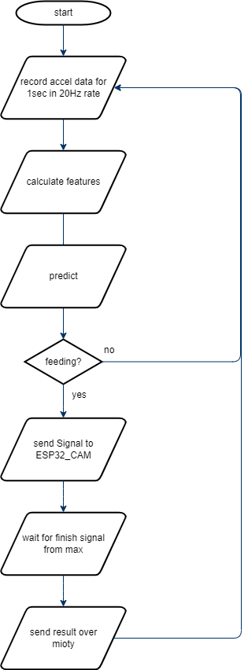

# V3 Tag
edit date 26.01.2023

## short description:
adalogger records acceleration data and runs the SVM algorithm on them. if the algorithm detects a feeding state addalogger send a signal to esp32_cam (pin defined in main.h) to take a picture. it waits then for one of the tow possible signals from max7800fthr (either Elephant or Rhino detected) and sends a message according to the signal through the mioty module  

## upload code
to upload the code main.ino inside main folder should be opened with the arduino software

if board library not installed yet go to File->Preferences in Additional Boards Manager URLs add: https://adafruit.github.io/arduino-board-index/package_adafruit_index.json and press ok
then go to Tools->Board->Boards Manager and search for and install Adafruit SAMD Boards

## the Files
<pre>
Vulture Behavior (Adafruit Adalogger).ino: the main code to upload to the adalogger
main.h:       file containing used (adjustable) parameter - to be changed if normal adjustment needed
i2c.h:        implemnting methods needed for I2C to recive data from accelerometer
imu.h:        record accel data
calc.h:       contains calculation methods needed for the allgorithm
mioty.h:      mioty model control
saveSD.h:     for saving data to SD Card
print.h:      for printing porposes
time.h:       for getting time if time sync from pc is enabled
model.h:      the SVM model
sv_activ_n.h: support vectors needed for model
sv_fly_eat.h: support vectors needed for model
</pre>
